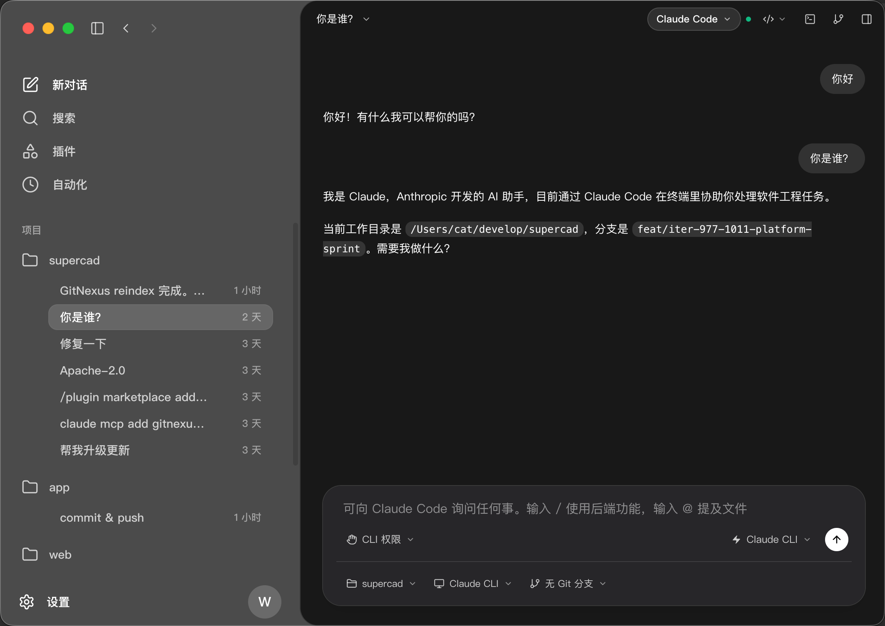
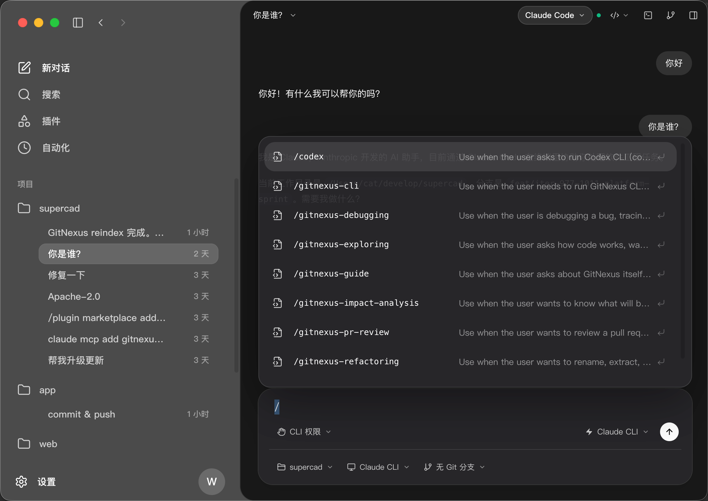
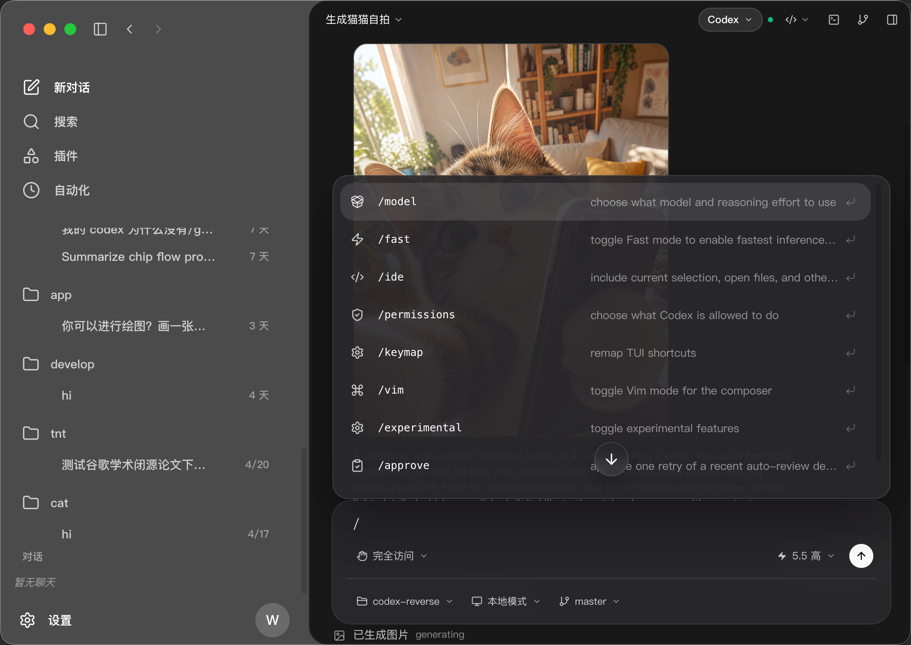
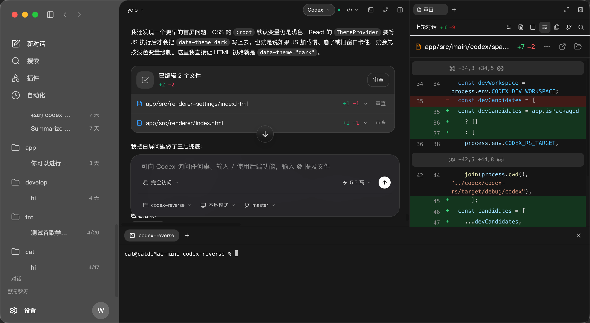

# Codex Reverse

Codex Reverse is a macOS desktop client for local agent CLIs. It can run with a user's own Codex CLI, and it also includes an experimental Claude Code mode that reads Claude Code history and starts Claude CLI sessions from the app.

The app does not bundle an account, token, or fixed CLI binary. Each user should install and configure their own CLI first.

## Screenshots

| Claude Code mode | Slash commands |
|---|---|
|  |  |

| Codex mode commands | Chat + diff review + terminal |
|---|---|
|  |  |

## Requirements

- macOS
- Node.js 22 or newer
- pnpm
- Codex CLI with `app-server` support for Codex mode
- Claude Code CLI for Claude Code mode

Check the CLIs before starting the desktop app:

```bash
codex --version
codex app-server --help
claude --version
```

You do not need to run `codex app-server` manually. The app starts and manages the subprocess.

## Install

```bash
git clone <repo-url>
cd codex-reverse
pnpm install
```

If you keep this project inside another workspace, use the `app/` directory as the repository root when publishing to GitHub.

## Run

Use the CLIs from `PATH`:

```bash
pnpm dev
```

Use a specific Codex binary:

```bash
CODEX_BIN=/absolute/path/to/codex pnpm dev
```

Use a separate Codex home:

```bash
CODEX_HOME="$HOME/.codex-desktop" pnpm dev
```

Use a specific Claude Code binary:

```bash
CLAUDE_BIN=/absolute/path/to/claude pnpm dev
```

Use a separate Claude home:

```bash
CLAUDE_HOME="$HOME/.claude-desktop" pnpm dev
```

Open a specific project on startup:

```bash
CODEX_PROJECT_CWD=/path/to/project pnpm dev
```

Start in a specific backend:

```bash
AGENT_BACKEND=codex pnpm dev
AGENT_BACKEND=claude pnpm dev
```

## CLI Resolution

Codex mode resolves the CLI in this order:

1. `CODEX_BIN`
2. Packaged app resource: `Resources/codex`
3. `CODEX_RS_TARGET`
4. `CODEX_DEV_WORKSPACE/codex-rs/target/*/codex`
5. A sibling development checkout at `../codex/codex-rs/target/*/codex`
6. `/Applications/Codex.app/Contents/Resources/codex`
7. `codex` from `PATH`

Claude Code mode resolves the CLI in this order:

1. `CLAUDE_BIN`
2. `claude` from `PATH`

## Configuration

Codex mode uses the same files as the Codex CLI unless overridden:

```text
~/.codex/config.toml
~/.codex/desktop-state.json
```

Claude Code mode uses the same files as Claude Code unless overridden:

```text
~/.claude/
```

Use separate homes if you want to test without touching your normal CLI setup:

```bash
CODEX_HOME="$HOME/.codex-desktop" CLAUDE_HOME="$HOME/.claude-desktop" pnpm dev
```

## Package

```bash
pnpm package
```

Create distributable artifacts:

```bash
pnpm make
```

## Troubleshooting

Codex mode opens but cannot chat:

```bash
codex app-server --help
```

If this command is missing, update your Codex CLI or point `CODEX_BIN` to a build that supports `app-server`.

Claude Code mode cannot send messages:

```bash
claude --version
CLAUDE_BIN="$(which claude)" pnpm dev
```

The app loads stale frontend code during development:

```bash
rm -rf .vite node_modules/.vite
pnpm dev -- --force
```

Use a clean temporary Codex config:

```bash
CODEX_HOME="$(mktemp -d)" CODEX_BIN="$(which codex)" pnpm dev
```

## Claude Code Compatibility

Claude Code support is implemented as a separate backend mode. It should not reuse Codex-only settings such as Codex reasoning effort or Codex permission labels.

The compatibility goal is:

- read local Claude Code project history from the user's Claude home
- start new Claude CLI sessions in the selected project directory
- keep Git and diff views scoped to the selected project
- expose slash commands from Claude Code built-ins plus installed local skills/plugins
- keep Codex slash commands and Claude slash commands separate

More details are in [docs/claude-code-compat.md](docs/claude-code-compat.md).
